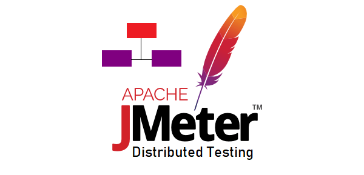

<h1 id="mainHeader" align="center">Jmeter   Distributed Load Test</h1> 

 

    

 

## İçindekiler

- [Proje Hakkında](#introductionHeader)
- [Teknolojiler](#technologiesHeader)
- [Özellikler](#featuresHeader)
- [Bağımlılıklar](#prerequisitesHeader)
- [Talimatlar](#instructionsHeader)
- [Katkıda Bulunanlar](#contributorsHeader)

 

<h2 id="introductionHeader">📌 Proje Hakkında</h2> 

Bu proje, dinamik olarak bulut üzerinde oluşturulan altyapı üzerinde dağıtık yük testi gerçekleştirmeyi ve bu hizmeti web servis aracılığı ile sunmayı hedeflemektedir.

 

<h2 id="technologiesHeader">☄️Teknolojiler</h2> 

### Test

### DevOps

### Bulut Sağlayıcılar

### Web

### Database

 

<h2 id="featuresHeader">✨ Özellikler</h2> 

* Minikube, Digital Ocean, Azure ve Aws ile farklı ortamlarlarda dinamik olarak test koşma olanağı.
* Kullanıcı verilerinin veritabanına işlenmesi.
* JWT access key ile kimlik doğrulaması.
* Websocket ile anlık test durumunun kullanıcıya bildirilmesi.
* Koşulan testlerin sonuçlarının dashboard üzerinden sergilenmesi.
* Http isteklerinin simule edilmesi.

 

<h2 id="prerequisitesHeader">🔒 Bağımlılıklar</h2> 

 

<h2 id="instructionsHeader">📋 Talimatlar</h2> 

 

<h2 id="contributorsHeader">👥 Geliştiriciler</h2> 

 

[🔝](#mainHeader)

